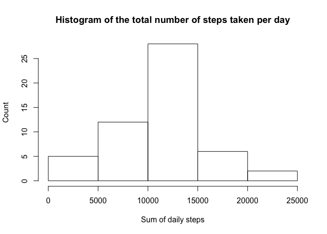
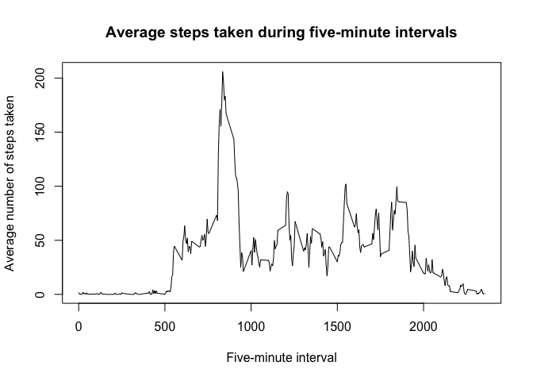
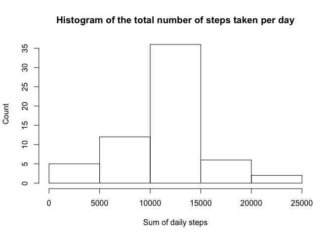
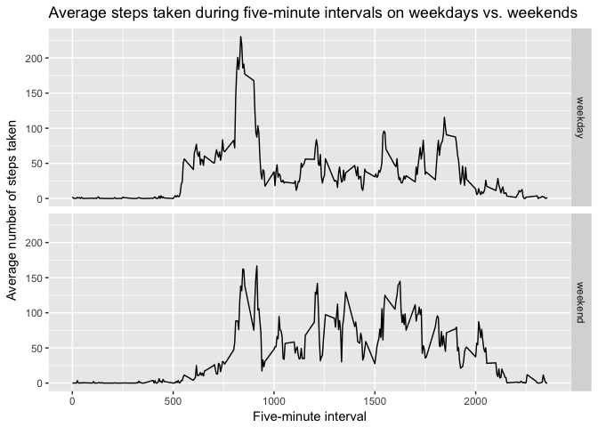

This document contains the solution to Course Project 1, which is focused on activity monitoring data.


## Loading and reprocessing the data

First, I load the data set provided on the course website (which I have downloaded and saved in my working directory):


```r
library(data.table)
```


```r
activity <- fread("./activity.csv")
str(activity)
```

```
## Classes 'data.table' and 'data.frame':	17568 obs. of  3 variables:
##  $ steps   : int  NA NA NA NA NA NA NA NA NA NA ...
##  $ date    : chr  "2012-10-01" "2012-10-01" "2012-10-01" "2012-10-01" ...
##  $ interval: int  0 5 10 15 20 25 30 35 40 45 ...
##  - attr(*, ".internal.selfref")=<externalptr>
```

The data set contains 17568 observations of 3 variables (`r colnames(activity)).

The date values are in character format right now, so I transform them:


```r
activity$date <- as.Date(activity$date, "%Y-%m-%d")
str(activity)
```

```
## Classes 'data.table' and 'data.frame':	17568 obs. of  3 variables:
##  $ steps   : int  NA NA NA NA NA NA NA NA NA NA ...
##  $ date    : Date, format: "2012-10-01" "2012-10-01" ...
##  $ interval: int  0 5 10 15 20 25 30 35 40 45 ...
##  - attr(*, ".internal.selfref")=<externalptr>
```


## What is the mean number of steps taken per day?

For now, I ignore missing values in the data set and follow the steps lined out by the assignment:

First, I calculate the total number of steps taken per day (using the dplyr package):


```r
library(dplyr)
```


```r
totalsteps <- activity %>% group_by(date) %>% summarize(sum_steps = sum(steps))
```

Here is a histogram of the total number of steps taken per day:


```r
hist(totalsteps$sum_steps, xlab = "Sum of daily steps", ylab = "Count", 
     main = "Histogram of the total number of steps taken per day")
```

<!-- -->

Finally, I calculate the mean and median of the total number of steps taken per day:


```r
mean(totalsteps$sum_steps, na.rm = TRUE)
```

```
## [1] 10766.19
```

```r
median(totalsteps$sum_steps, na.rm = TRUE)
```

```
## [1] 10765
```


## What is the average daily activity pattern?

First, I calculate the average number of steps in every five-minute interval (again using the dplyr package):


```r
stepintervals <- activity %>% group_by(interval) %>% summarize(mean_steps = mean(steps, na.rm = TRUE))
```

Here is a time series plot of these averages:


```r
plot(stepintervals$interval, stepintervals$mean_steps, type = "l", 
     xlab = "Five-minute interval",
     ylab = "Average number of steps taken",
     main = "Average steps taken during five-minute intervals")
```

<!-- -->

Finally, I identify the interval containing the maximum number of steps:


```r
stepintervals$interval[which.max(stepintervals$mean_steps)]
```

```
## [1] 835
```


## Imputing missing values

First, I calculate the number of missing values in the data set:


```r
sum(is.na(activity))
```

```
## [1] 2304
```

Quite a few missing values!

To fill the missing values, I decide resort to the five-minute interval means - whenever a value is missing, I fill the cell with the mean number of steps:


```r
imputed <- activity
for(i in 1:nrow(imputed)) {
        if(is.na(imputed$steps[i])) {
               # find the right interval in the data set of five-minute interval variables:
               avg <- which(imputed$interval[i] == stepintervals$interval)
               # replace the NA value with the average:
               imputed$steps[i] <- stepintervals[avg,]$mean_steps 
        }
}
```

A quick check if the loop worked:


```r
sum(is.na(imputed))
```

```
## [1] 0
```

Now, I plot the new data set filled with the imputed values in a histogram:


```r
# Calculate sum of steps per day:
totalsteps_imputed <- imputed %>% group_by(date) %>% summarize(sum_steps = sum(steps))

# produce histogram:
hist(totalsteps_imputed$sum_steps, xlab = "Sum of daily steps", ylab = "Count", 
     main = "Histogram of the total number of steps taken per day")
```

<!-- -->

This looks similar to the histogram produced earlier (even though differences are visible)

How about the mean and median values?


```r
mean(totalsteps_imputed$sum_steps)
```

```
## [1] 10766.19
```

```r
median(totalsteps_imputed$sum_steps)
```

```
## [1] 10766.19
```

The mean is the same in the raw and the imputed data set (which makes sense considering the imputation method), but the median is equal to the mean  (which also makes sense considering the imputation method - now, the mean values are much more frequent in the data set).


## Are there differences in activity patterns between weekdays and weekends?

To answer this question, I first create a new factor variable with two levels – “weekday” and “weekend” indicating whether a given date is a weekday or weekend day:


```r
# Extract the weekdays from the dates:
imputed$day <- weekdays(imputed$date)

# Create the factor variable:
for(i in 1:nrow(imputed)) {
        if(imputed$day[i] == "Saturday") {
                imputed$daytype[i] <- "weekend"
        } else {
                if(imputed$day[i] == "Sunday") {
                        imputed$daytype[i] <- "weekend"
                } else {
                        imputed$daytype[i] <- "weekday"
                }
                
        }
}
```

Now, I can use the new variable to calculate the average number of steps in every five-minute interval for weekdays and weekends (again using the dplyr package):


```r
stepintervals <- imputed %>% group_by(daytype, interval) %>% summarize(mean_steps = mean(steps, na.rm = TRUE))
```

This time, I use ggplot2 to easily construct a grouped plot:


```r
library(ggplot2)
qplot(interval, mean_steps, data = stepintervals,
      geom = "line", facets = daytype ~ .,
      xlab = "Five-minute interval",
      ylab = "Average number of steps taken", 
      main = "Average steps taken during five-minute intervals on weekdays vs. weekends")
```

<!-- -->
